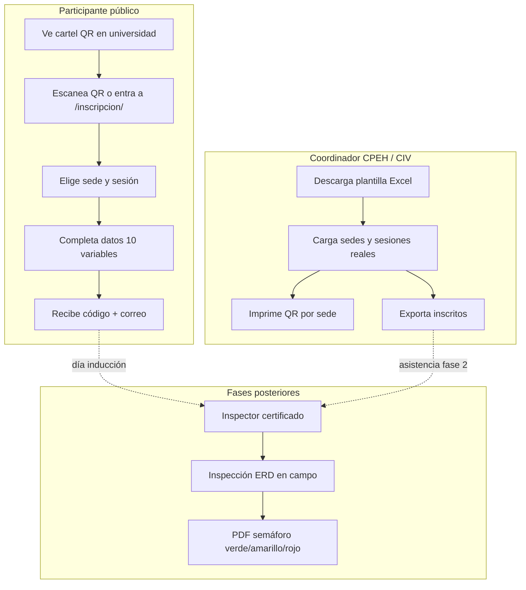
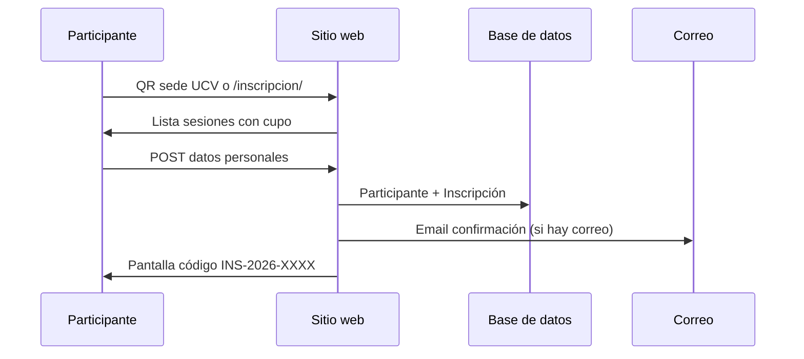
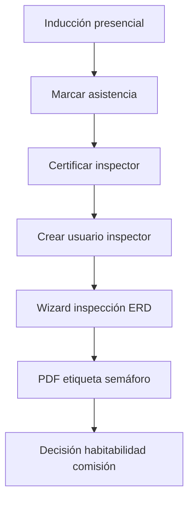

# Flujo de procesos — Sistema CPEH

**Comisión Presidencial para la Evaluación de Habitabilidad**  
Post-terremoto 24-jun-2026 · Capacitación de inspectores + inspecciones ERD

---

## 1. Vista general (tres actores)



---

## 2. Flujo de inscripción (implementado)



**Variables del formulario:**

| # | Campo | Origen |
|---|--------|--------|
| 1–3 | Lugar, fecha, hora | Automático (sesión elegida) |
| 4–10 | C.I., nombres, teléfono, correo, profesión, procedencia | Tecleados por participante |

---

## 3. Flujo coordinador — carga masiva sin sedes reales aún

Cuando **aún no tiene** la lista oficial:

1. Entrar a **Panel** → `/panel/` (usuario staff: `admin`)
2. **Descargar plantilla Excel** (`/panel/plantilla-excel/`)
3. Completar hoja `sedes` con universidades/auditorios confirmados
4. Subir Excel → **Importar** (`/panel/importar/`)
5. Cuando definan fechas, completar hoja `sesiones` y volver a importar
6. En **Sedes y QR**, descargar PNG por sede e imprimir carteles


---

## 4. ¿Para qué sirve el QR descargable?

| Sin QR impreso | Con QR impreso |
|----------------|----------------|
| El participante debe buscar el sitio, elegir sede en lista | Escanea y llega **directo** a su universidad |
| Más fricción en pasillos abarrotados | Cartel en entrada: «Inscríbase aquí» |
| Riesgo de elegir sede equivocada | La sede ya viene **preseleccionada** |

El PNG es para **imprimir o pegar en presentaciones**; el enlace subyacente es  
`https://su-sitio/inscripcion/sede/ucv/` (en local: `http://127.0.0.1:8000/inscripcion/sede/ucv/`).

> **Importante:** En producción configure `SITE_URL` en `.env` para que el QR apunte al dominio público, no a localhost.

---

## 5. Correo de confirmación — cómo funciona

| Entorno | Configuración | Comportamiento |
|---------|---------------|----------------|
| **Desarrollo** | `EMAIL_BACKEND=console` (default) | El correo aparece en la **terminal** del `runserver` |
| **Producción** | SMTP en `.env` | Se envía al email del participante |

Variables en `.env`:

```env
EMAIL_HOST=smtp.gmail.com
EMAIL_PORT=587
EMAIL_USE_TLS=True
EMAIL_HOST_USER=...
EMAIL_HOST_PASSWORD=...
DEFAULT_FROM_EMAIL=CPEH <capacitacion@ejemplo.gob.ve>
SITE_URL=https://cpeh.onrender.com
```

Solo se envía si el participante indicó **correo electrónico** en el formulario.

---

## 6. Branding institucional (bandera de Venezuela)

| Elemento | Valor |
|----------|--------|
| Nombre corto | **CPEH** |
| Amarillo | `#FFCC00` (franja superior) |
| Azul | `#00247D` (franja central, navbar, botones) |
| Rojo | `#CF142B` (franja inferior, acentos) |
| Estrellas | **8 estrellas blancas** en arco sobre franja azul |
| Logo | `static/img/logo-cpeh.svg` (tricolor + estrellas + edificio) |
| Semáforo footer | Verde / amarillo / rojo (habitabilidad ERD) |

Sustituir o combinar con logo oficial CIV / comisión cuando esté disponible.

---

## 7. Rutas del sistema

| Ruta | Quién | Función |
|------|-------|---------|
| `/` | Público | Inicio |
| `/inscripcion/` | Público | Inscripción general |
| `/inscripcion/sede/<slug>/` | Público | Inscripción por QR |
| `/panel/` | Coordinador | Dashboard |
| `/panel/importar/` | Coordinador | Subir Excel |
| `/panel/sedes/` | Coordinador | QR por sede |
| `/admin/` | Admin técnico | Django admin |

---

## 8. Próximos procesos (no implementados aún)


